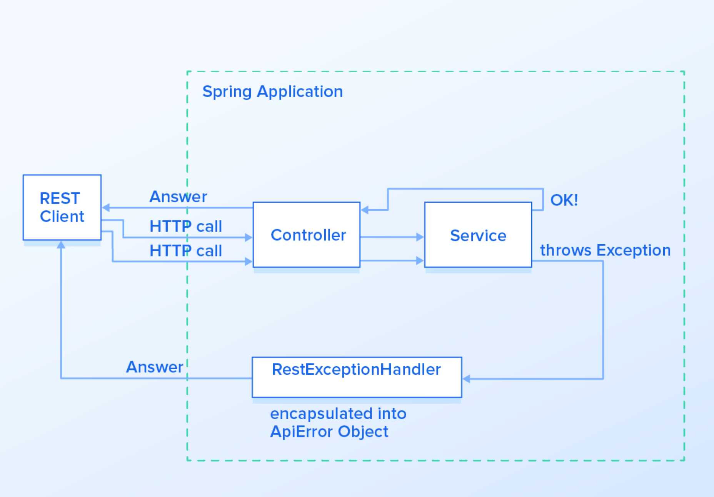
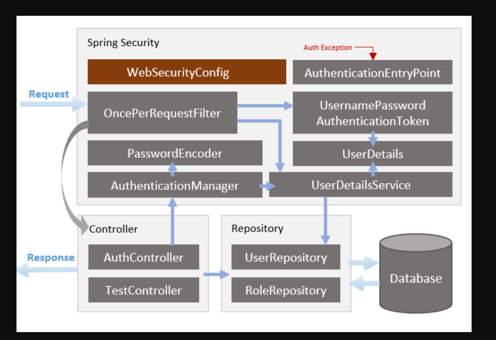

# API mock demo Spring Boot + my SQL

# Summary demo project:
  1. Authentication and authorization
  2. Handler error, AOP logging, message
  3. Web design html, css, jquery...
  4. CRUD sample + swagger

## Project Architecture
<a href="#" target="blank">
    </a>
<a href="#" target="blank">
    </a>

## Technology Stack & Information system
1. Java version 21   
2. Spring boot 3.2.2 RELEASE 
   1. spring-boot-starter-web
   2. spring-boot-starter-data-jpa
   3. spring-boot-starter-security
   4. spring-boot-starter-validation
   5. spring-boot-starter-thymeleaf
   5. Spring AOP concepts..
3. Maven 4.0.0
4. Mysql (lasted)
5. Docker / Docker Compose

## Step run project
1. Setup and run docker Mysql
```
 # cd {projectPath}/DockerConfig/MySql
 cd ./DockerConfig/MySql

 docker-compose up -d
```
2. Run and build project Spring boot to jar with docker
 ```
# build to jar at this local folder

mvn clean package
# build image PhucBE docker (--no-cache)
cd ../BE
docker build -t be_phuc_image .
docker run -p 8080:8080 -d be_phuc_image
```
3. Testing
   1. Open browser with url <a href="http://localhost:8080" target="blank">localhost:8080</a> to open website
   2. Check html documentation at <a href="http://localhost:8080/swagger-ui/index.html" target="blank">😱Not support Swagger for JakartaEE 😭😭😭</a>.
   2. Check API documentation at <a href="http://localhost:8080/v3/api-docs" target="blank">😱click</a>.

# Author
<h2 style="display: c">Hi 👋, I'm Phúc Kute</h2>
<h3 align="center">Start learning Developer at <a href="https://google.com" target="blank">phuckute.com</a></h3>
<h2 style="display: c">Thank you!</h4>

# Hướng Dẫn Cài Đặt Docker

## Windows 10 và 11

1. Tải Docker Desktop từ trang chính thức của Docker: [Docker Desktop](https://www.docker.com/products/docker-desktop)
2. Chạy tệp cài đặt và làm theo hướng dẫn để hoàn thành quá trình cài đặt.

## Linux

1. Mở terminal và chạy các lệnh sau để cài đặt Docker:

    ```bash
    sudo apt update
    sudo apt install docker.io
    ```

2. Khởi động Docker và đặt nó để khởi động cùng hệ thống:

    ```bash
    sudo systemctl start docker
    sudo systemctl enable docker
    ```

3. (Tùy chọn) Thêm người dùng vào nhóm "docker" để chạy Docker mà không cần sudo:

    ```bash
    sudo usermod -aG docker $USER
    ```

   Đăng nhập lại để thay đổi có hiệu lực.

## macOS

1. Sử dụng Homebrew để cài đặt Docker:

    ```bash
    brew install --cask docker
    ```

2. Mở Docker Desktop sau khi cài đặt và làm theo hướng dẫn.

Lưu ý: Đảm bảo bạn sử dụng tài khoản có quyền quản trị để cài đặt Docker.